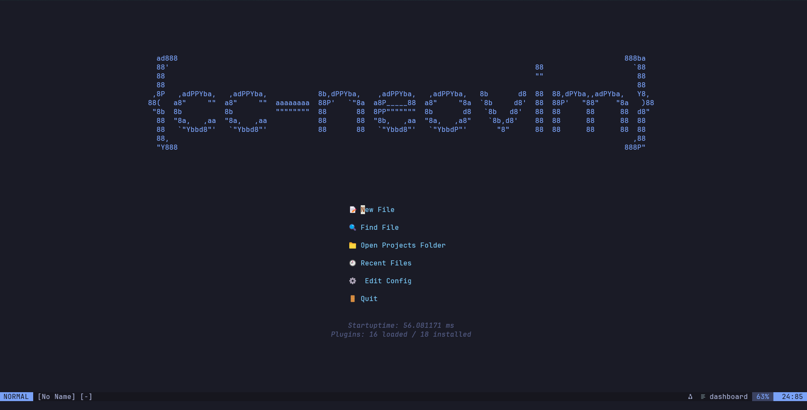

rp align="center">
    
</p>

[](https://zimmerman-dev.github.io/cc-neovim)     

_Modular, headless-first Neovim configuration built for fast, minimalist C/C++ development._

# ✨ Features

- **Minimalist UI** – a clean, distraction-free terminal interface
- **Fast startup** – powered by lazy-loaded modular plugins
- **C/C++-focused** – tailored snippets, LSP support, and fuzzy file finding
- **Insert-ready terminal splits** – open horizontal or vertical terminals in insert mode
- **Readable keymaps** – consistent `(SPC key key)` leader-based shortcuts
- **Beautiful colorscheme** – Tokyo Night with centered dashboard branding

# 📁 Project Structure

```
cc-neovim/
├── assets/ # Custom images (e.g., for README or dashboard)
├── snippets/ # LuaSnip-based snippets for C and C++
├── lua/
│ ├── core/ # Core config (options, keymaps, lazy.nvim, etc.)
│ ├── plugins/ # Individual plugin setups
│ └── colorscheme/ # Color scheme configuration
├── init.lua # Entry point, loads core and plugins
├── lazy-lock.json # Plugin lock file (optional in version control)
├── LICENSE # MIT License
├── README.md # This file

```

# 📦 Dependencies List

CC-Neovim requires only a few system packages to provide full IDE-like functionality in a headless environment.

>✅ Core Requirements
> - **Neovim 0.9+** – main editor
> - **git** – for plugin management
> - **unzip** – required for certain plugin installs

>🛠 Development Tools
> -  **clangd** – C/C++ language server
> - **cmake** – recommended for C++ project builds
> - **gdb** – debugger integration

>🔍 Search Utilities
> - **ripgrep (rg)** – fast project-wide search
> - **fd** – file finder used by Telescope and other pickers

>🌀 Build Helpers
> - **make** – speeds up build tasks

>🌙 Optional (but Recommended)
> - **lua-language-server** – improves Neovim’s built-in Lua LSP, making editing `init.lua` and config modules much smoother
> - **glow** - markdown preview, no GUI required


# 🔹 Installing Dependencies

#### Fedora
```bash
sudo dnf install neovim git unzip glow clang-tools-extra cmake gdb make ripgrep fd-find lua-language-server
```

#### Ubuntu/Debian
```bash
sudo apt install neovim git unzip clangd cmake gdb make ripgrep fd-find lua-language-server
```

# 📌 Note on Lua Language lua-language-server

Some distributions ship outdated or broken versions of `lua-language-server`.
If the package from your package manager doesn’t work, you can build it manually:

### ✅ Lua Language Server (Manual Install)

Follow these commands in order:
```
git clone https://github.com/LuaLS/lua-language-server.git ~/.config/lua-language-server
```
```
cd ~/.config/lua-language-server
```
```
git submodule update --init --recursive
```
```
export PATH="$HOME/.config/lua-language-server/bin:$PATH"
```

You can make this change permanent by adding that line to your `~/.bashrc` or `~/.zshrc`.


# 🔧 Installing cc-neovim (MUST READ)

Neovim loads configuration from `~/.config/nvim` by default.
If you already have a config there, you should **back it up first** before cloning or creating a symlink.

## 🛡️ Backup Existing Config
```bash
mv ~/.config/nvim ~/.config/nvim.backup.$(date +%Y%m%d)
```

#### 🔗 Option 1: Symlink

Clone cc-neovim anywhere, and symlink the path to the cc-neovim repo. (do not just copy and paste, you need to type your own path.)
```bash
git clone https://github.com/zimmerman-dev/cc-neovim.git
```

*Then:*
```bash
ln -s /path/to/cc-neovim ~/.config/nvim
```

#### 📥 Option 2: Clone Directly to ~/.config/nvim

Alternatively, clone straight into the Neovim config directory:
```bash
git clone https://github.com/zimmerman-dev/cc-neovim.git ~/.config/nvim
```

Then launch Neovim:
```bash
nvim
```

Lazy.nvim will install your plugins automatically on first launch.

#### Note on Git:

After cloning:

- **For personal use (recommended):**

Remove Git tracking so you can freely tweak the config without Git warnings:

```
rm -rf ~/.config/nvim/.git
```
- **For contributing to CC‑Neovim:**

Fork the repository on GitHub and clone your fork. This keeps Git tracking intact so you can push changes and submit PRs upstream.


### 🎹 Key-bindings

| Keybinding | Mode(s)  | Description                  |
| ---------- | -------- | ---------------------------- |
| `SPC f s`  | Normal   | Save file                    |
| `SPC q q`  | Normal   | Quit Neovim                  |
| `SPC f f`  | Normal   | Fuzzy find files (Telescope) |
| `SPC t t`  | Normal   | Open horizontal terminal     |
| `SPC t v`  | Normal   | Open vertical terminal       |
| `<Esc>`    | Terminal | Exit terminal mode           |

**Full list in `cc-neovim/docs`, but you can customize yourself in `lua/core/keymaps.lua`**


### ✍️ Custom Snippets

You’ll find LuaSnip-powered C/C++ snippets under:

```bash
snippets/c/init.lua
snippets/cpp/init.lua

```

### 🪪 Credits

CC-Neovim was built with inspiration from the Neovim and Doom Emacs ecosystems.
Special thanks to the developers behind:

- [lazy.nvim](https://github.com/folke/lazy.nvim) for fast plugin management
- [nvim-cmp](https://github.com/hrsh7th/nvim-cmp) for completion
- [LuaSnip](https://github.com/L3MON4D3/LuaSnip) for custom snippet support
- [tokyonight.nvim](https://github.com/folke/tokyonight.nvim) for the beautiful colorscheme
- [dashboard-nvim](https://github.com/nvimdev/dashboard-nvim) for the clean start screen
- And the wider Neovim community for tools, documentation, and a hacker's spirit

 **📜 License**
This project is licensed under the MIT License.


*cc-neovim is crafted for terminal-first C++ development — minimal, modular, and yours to fork.*
