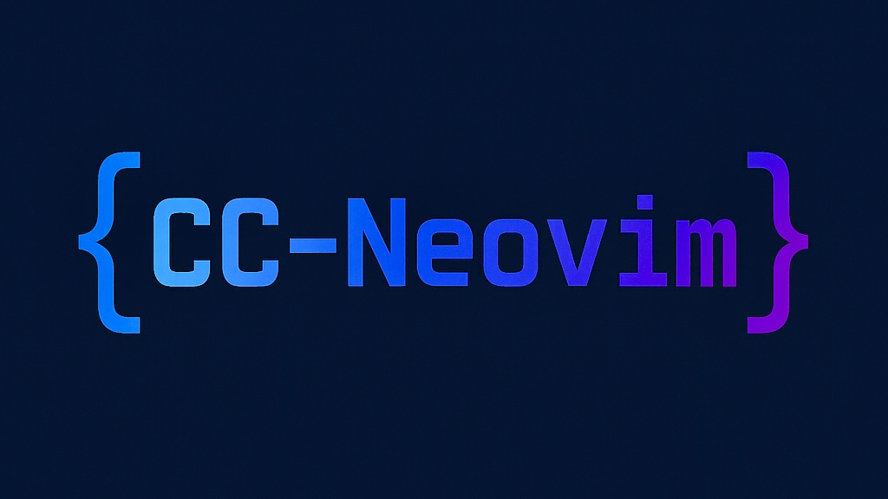

<p align="center">
    

[](https://zimmerman-dev.github.io/cc-neovim)


>_Modular, headless-first Neovim configuration built for fast, minimalist C/C++ development._

## ✨ Features

- **Minimalist UI** – a clean, distraction-free terminal interface
- **Fast startup** – powered by lazy-loaded modular plugins
- **C/C++-focused** – tailored snippets, LSP support, and fuzzy file finding
- **Insert-ready terminal splits** – open horizontal or vertical terminals in insert mode
- **Readable keymaps** – consistent `(SPC key key)` leader-based shortcuts
- **Beautiful colorscheme** – Tokyo Night with centered dashboard branding

## 📁 Project Structure

```
cc-neovim/
├── assets/ # Custom images (e.g., for README or dashboard)
├── snippets/ # LuaSnip-based snippets for C and C++
├── lua/
│ ├── core/ # Core config (options, keymaps, lazy.nvim, etc.)
│ ├── plugins/ # Individual plugin setups
│ └── colorscheme/ # Color scheme configuration
├── init.lua # Entry point, loads core and plugins
├── lazy-lock.json # Plugin lock file (optional in version control)
├── LICENSE # MIT License
├── README.md # This file

```
## 🔧 Installation

```bash
git clone https://github.com/yourusername/cc-neovim ~/.config/nvim
```

Make sure you have:

- Neovim v0.9+

- clangd and lua-language-server in your $PATH

- Git, C compiler, and your usual dev tools

Then launch Neovim:

```bash
nvim
```
Lazy.nvim will install your plugins automatically on first launch.

## 🎹 Keybindings

| Keybinding           | Mode(s)      | Description                            |
|----------------------|--------------|----------------------------------------|
| `SPC f s`            | Normal       | Save file                              |
| `SPC q q`            | Normal       | Quit Neovim                            |
| `SPC f f`            | Normal       | Fuzzy find files (Telescope)           |
| `SPC h t`            | Normal       | Open horizontal terminal               |
| `SPC v t`            | Normal       | Open vertical terminal                 |
| `<Tab>`              | Insert/Snippet | Jump to next snippet placeholder     |
| `<S-Tab>`            | Insert/Snippet | Jump to previous snippet placeholder |
| `<Up>` / `<Down>`    | Insert       | Navigate completion menu               |
| `<Right>` / `<CR>`   | Insert       | Confirm selection from completion menu |
| `<Esc>`              | Terminal     | Exit terminal mode                     |
| `:tabn` / `:tabp`    | Normal       | Switch to next / previous tab          |


## ✍️ Custom Snippets

You’ll find LuaSnip-powered C/C++ snippets under:

```bash
snippets/c/init.lua
snippets/cpp/init.lua

```

## 📜 License 
This project is licensed under the MIT License.

---

### 🪪 Credits

CC-Neovim was built with inspiration from the Neovim and Doom Emacs ecosystems.  
Special thanks to the developers behind:

- [lazy.nvim](https://github.com/folke/lazy.nvim) for fast plugin management  
- [nvim-cmp](https://github.com/hrsh7th/nvim-cmp) for completion  
- [LuaSnip](https://github.com/L3MON4D3/LuaSnip) for custom snippet support  
- [tokyonight.nvim](https://github.com/folke/tokyonight.nvim) for the beautiful colorscheme  
- [dashboard-nvim](https://github.com/nvimdev/dashboard-nvim) for the clean start screen  
- And the wider Neovim community for tools, documentation, and a hacker's spirit

CC-Neovim is crafted for terminal-first C++ development — minimal, modular, and yours to fork.

